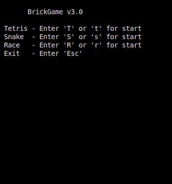

# BrickGame Гонки (Python)

Реализация игры «Гонки» на языке программирования Python.

## Описание проекта
- Игры:
  - Тетрис (библиотека реализована на C),
  - Змейка (библиотека реализована на C++),
  - Гонки (библиотека реализована на Python)
- Интерфейсы:
  - Консольный реализован на C (ncurses),
  - Десктопный реализован на C++ (Qt),
  - Веб (HTML, CSS, JS)
- Остальное:
  - сервер написан на Python (FastAPI),
  - библиотека-клиент написана на C++ (libcurl, nlohmann/json).

## Реализация BrickGames v3.0

- Сервер разработан на языке Python.
- При формализации игровой логики использовались конечные автоматы.
- Реализован REST API для клиент-серверного взаимодействия.
- Библиотека, реализующая логику игры, покрыта unit-тестам с использованием библиотеки `unittest`.
- Настрена раздача статических файлов.
- Сервер поддерживает игры из предыдущих проектов BrickGame.
- Консольный интерфейс поддерживает игру гонки.
- Десктопный интерфейс поддерживает игру гонки.
- Для взаимодействия с REST API разработана библиотека-клиент, инкапсулирующая взаимодействие с сервером. Данная библиотека используется для поддержания игры в консольном и десктопном клиентах.

## Управление и игровое поле

- В игре гонки должны присутствовуют следующие механики:
  - Машина игрока может двигаться по горизонтали при нажатии стрелок влево/вправо;
  - При столкновении с другой машиной игра заканчивается;
  - Машины противника появляются у верхнего края игрового поля и постепенно смещаются вниз;
  - При зажатии стрелки вперед, машины противников смещаются с увеличенной скоростью, которая отображается в интерфейсе.
- Для управления имеется поддержка всех кнопок, предусмотренных на физической консоли:
  - Начало игры - 'ENTER',
  - Пауза - 'P',
  - Завершение игры - 'ESC',
  - Стрелка влево — сместиться влево,
  - Стрелка вправо — сместиться вправо,
  - Стрелка вверх — ускорить движение машины,
- Размер игрового поля 10 «пикселей» в ширину и 20 «пикселей» в высоту.
- подсчет очков.
- хранение максимального количества очков.
- каждый раз, когда игрок набирает 5 очков, уровень увеличивается на 1 (максимум - 10 уровней).

## Build

Сборка программы настроена с помощью Makefile

* `make install` - Компиляция консольной и десктопной версии игры BrickGame_v2.0
* `make unistall` - Удаление консольной и десктопной версии игры
* `make test` - Тестирование библиотеки c помощью unittest
* `make coverage` - Формирование отчёта о покрытии кода в виде html страницы
* `make style` - Проверка C/C++ кода на Google style
* `make clean` - Удаление ненужных файлов
* `make server` - Запуск сервера

## Запуск игры BrickGame v3.0

### Command-line Interface

### Desktop

### Web

